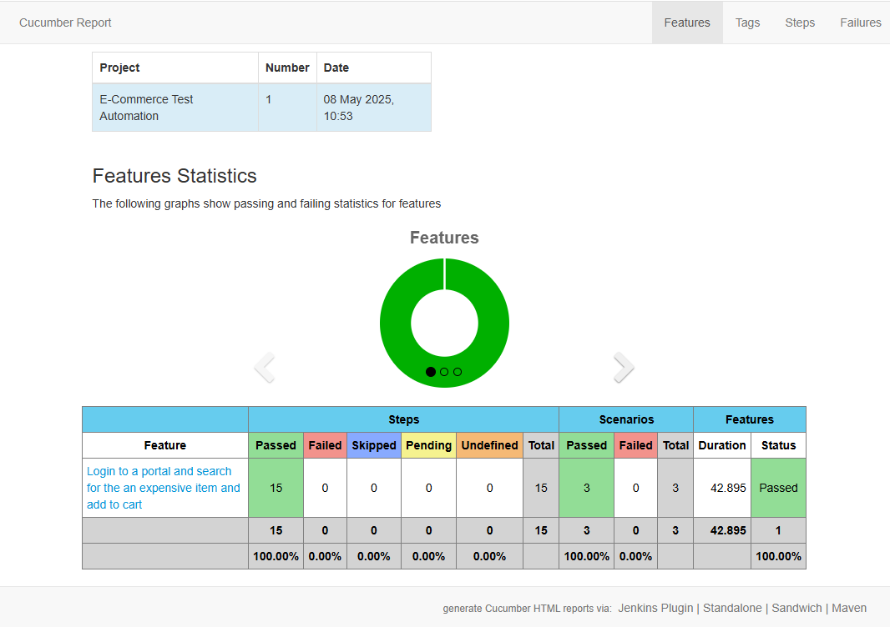

# E-Commerce Test Automation Project

This project is a sample automation framework for an e-commerce platform, built using **Java**, **Selenium WebDriver**, **Cucumber BDD**, and integrated with reporting tools. It allows you to execute end-to-end tests and generate rich reports for better insights.

---

## Table of Contents
- [Project Overview](#project-overview)
- [Core Libraries and Tools](#core-libraries-and-tools)
- [Folder Structure](#folder-structure)
- [How To Run The Tests](#how-to-run-the-tests)
- [Report Generation](#report-generation)
- [Contributing](#contributing)
- [Contact](#contact)

---

## Project Overview

This framework automates user flows for an e-commerce platform and is designed for scalability, maintainability, and integration with CI/CD pipelines. It leverages Cucumber for BDD (Behavior-Driven Development), allowing business-readable tests and supports robust reporting for test results.

---

## Core Libraries and Tools

- **Java 11**: Programming language for automation code.
- **[Selenium WebDriver](https://www.selenium.dev/)**: Browser automation.
- **[Cucumber](https://cucumber.io/)**: BDD framework for writing feature files in Gherkin.
    - `cucumber-java`
    - `cucumber-junit`
    - `cucumber-picocontainer`
- **[WebDriverManager](https://github.com/bonigarcia/webdrivermanager)**: Automatic browser driver management.
- **[JUnit 4](https://junit.org/junit4/)**: Test runner and assertions.
- **[SLF4J](http://www.slf4j.org/), Logback**: Logging.
- **[cucumber-reporting (Masterthought)](https://github.com/damianszczepanik/cucumber-reporting)**: Advanced test report generation.
- **Maven**: Build automation and dependency management.

---

## Folder Structure

```
selenium-java-cucumber/
├── pom.xml                      # Maven configuration and dependencies
├── README.md                    # Project documentation
├── RunTestsOnMac.sh             # Shell script to run tests on macOS
├── RunTestsOnWindows.cmd        # Windows batch script to run tests
└── src
    ├── main
    │   └── java
    │       └── pages/           # Page Object Model classes for UI abstraction
    └── test
        ├── java/                # Step Definitions and Test Runners
        └── resources/           # Feature files and test data
```

- `pom.xml`: Configures dependencies like Selenium, Cucumber, JUnit, reporting plugins, and build plugins.
- `src/main/java/pages`: Contains Java classes modeling different application pages and actions (Page Objects).
- `src/test/java`: Houses step definitions and test runner classes.
- `src/test/resources`: All feature files written in Gherkin syntax, as well as test configuration and data files.

---

## How To Run The Tests

### **Pre-requisites**
- Java 11+
- Maven 3.6+
- Git

### **Initial Setup**
1. Clone this repository:
   ```sh
   git clone <repository-url>
   cd selenium-java-cucumber
   ```
2. Install dependencies:
   ```sh
   mvn clean compile
   ```

### **Running Tests (Cross Platform):**

You can use Maven directly:
```sh
mvn clean test
```

Or use the provided scripts:
- **Windows:**
  ```sh
  RunTestsOnWindows.cmd
  ```
- **macOS/Linux:**
  ```sh
  chmod +x RunTestsOnMac.sh
  ./RunTestsOnMac.sh
  ```

**TestRunner:**  
Maven Surefire Plugin is configured to automatically detect and execute any class with the pattern `*Runner.java` as a test suite.

**Test Filtering:**  
You may use [Cucumber tags](https://cucumber.io/docs/cucumber/api/#tags) for selective test execution by configuring Maven's `cucumber.filter.tags` property.

---

## Report Generation

### **Cucumber Basic Reports**
- Cucumber automatically generates basic HTML and JSON reports in `target/cucumber-reports/`.

### **Advanced Reporting with Masterthought**
- A comprehensive, customizable HTML report is generated after test execution via the `maven-cucumber-reporting` plugin.
- After running tests, the report can be found at:
    ```
    target/cucumber-reports/cucumber-html-reports/overview-features.html
    ```

#### **How it Works**
- The `maven-cucumber-reporting` plugin processes the `cucumber.json` produced by Cucumber.
- Configuration options (such as output and input directories, project name, and classifications) are present in the `pom.xml`.

#### **Sample Execution Report Contents:**
- **Feature overview**
- **Step breakdown**
- **Tags**
- **Error stack traces for failures**
- **Trends over multiple runs** (if applicable)


---

## Contributing

Contributions are welcome! Please fork the repository, create a feature branch, commit your changes, and open a Pull Request.

---

## Contact

For questions or issues, please create an issue in the repository or reach out to the project maintainer.

---
